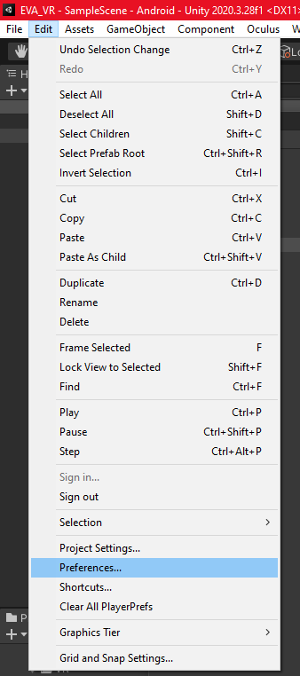

# EVA_VR <!-- omit in toc -->

Projet de galerie VR en Unity pour les étudiants 2021-2022

## Sommaire <!-- omit in toc -->

- [Configuration](#configuration)
  - [Unity](#unity)
  - [Git](#git)
- [Build](#build)
- [Test coverage](#test-coverage)

## Configuration

Pour développer sur ce projet, vous allez devoir suivre la configuration des rubriques ci-dessous.

### Unity

Ce projet utilise la version éditeur **2020.3.28f1**.
Pour pouvoir utiliser le projet correctement il est conseillé d'installer la documentation ainsi que l'android build support qui contient l'android sdk et ndk tools
ainsi que l'open jdk comme ci-dessous. Le projet sera réglé pour cette version, si vous utilisez une version différente veillez à le mettre à niveau avec l'ensemble
de l'équipe de développement.


### Git

Pour que ce projet soit utilisable correctement en local, vous aller avoir besoin de modifier le fichier *.git/config* pour modifier l'outil permettant de merge les branches. L'outil actuel est très puissant, et le problème ne vient pas vraiment de lui. Le problème vient de Unity qui en enregistrant au format YAML ne le fait pas forcément dans le même ordre, et peut faire penser au mergeur de base que ce ne sont pas les mêmes fichiers. Pour résoudre ce problème, vous allez ajouter les lignes suivantes au *.git/config* :

```YAML
[merge]
tool = unityyamlmerge
[mergetool "unityyamlmerge"]
cmd = 'Chemin_vers_votre_version\\2020.3.28f1\\Editor\\Data\\Tools\\UnityYAMLMerge.exe' merge -p "$BASE" "$REMOTE" "$LOCAL" "$MERGED"
trustExitCode = false
keepTempories = true
keepBackup = false
```

N'oubliez pas de remplacer *Chemin_vers_votre_version* par le chemin de votre machine et vers la bonne version de l'éditeur de Unity.

## Build

Pour build le projet, il va falloir changer quelque chose dans le compilateur android de votre version d'Unity, voici la démarche \
Commencez d'abord par ouvrir le menu *Edit > Preferences*.



Une fois à l'intérieur, dans le sous menu *External Tools* cherchez le SDK android servant à compiler votre projet et copiez le chemin.


Ensuite ouvrez un terminal et placez vous dans le chemin récupéré ci-dessus, allez ensuite dans *.platform-tools*. A cet endroit tapez cette commande :
```
.\adb.exe shell setprop debug.oculus.experimentalEnabled 1
```
Ce qui devrait donner ça dans votre terminal


Ensuite, il faut référencer la clé de build.
Pour cela, allez dans *File > Build Settings*. 


Puis dans Player Settings.


Une fois la fenêtre ouverte, il faut modifier les Publishing Settings.
S'il n'y en a pas, il faut rajouter une Custom Keystore en sélectionnant le fichier build.keystore qui est à la racine du projet Unity, dans EVA_VR. Il faut rentrer le mot de passe *eva_vr* pour les deux champs password. 


Une fois ceci fait vous pouvez build le projet sur votre ordinateur.

## Test coverage

Afin d'avoir accès au test coverage des différents tests unitaires effectués
sur Unity il faut activer la fenête "Code Coverage" dans Unity. Pour cela il faut se rendre dans *Edit* > *Preferences* > *General* et cocher *enable Code Coverage*. De plus si le package Code Coverage n'est pas installé sur votre machine n'oubliez pas de cliquer sur le bouton *Install Code Coverage package*.


Une fois ceci effectué il suffit de run tous les tests unitaires développés afin de générer un fichier index.html présent à l'endroit que vous aurez indiqué dans la fenêtre de Code Coverage dans *Destination*.


NB : Avoir Code Coverage activé ralentit significativement les performances de l'Editor, de ce fait il est conseillé de désactiver cette fonctionalité lorsqu'elle n'est pas utilisée.