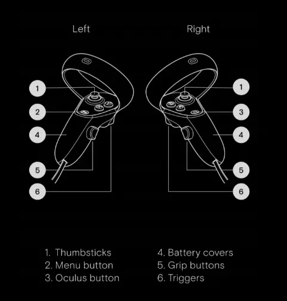

# EVA User Guide

## Contents <!-- omit in toc -->

- [EVA User Guide](#eva-user-guide)
  - [Changelog V0.4](#changelog-v04)
  - [Controls](#controls)
  - [First steps](#first-steps)
  - [Importation](#importation)

## Changelog V0.4

- Adding modular interface
- Adding the possibility to save and load the gallery
- Adding the differents modes of the gallery (EDITOR, VISTITOR, ...)
- Adding Locking position, rotation and scale of an object
- Walls are now just locked in rotation at the creation but can be moved
- Adding visuals to the changing hand feature

## Controls

## First steps

Once the app is launched, you will see the Title Menu. From there, you can either create a new gallery or quit the application. The load functionalities does not work in this scene but does in the gallery. \
In the gallery, you can open the Main Menu with the **Menu** button. 
You can interact with the user interface by pointing at a button and pressing the **Right Trigger** or you can navigate through it using the **Left Thumbstick** and the **A**. 
When you press **A** it will launch the button in red, in contrary to the **Right Trigger**, which will launch the button in collision with the laser.
All the button are working, including the setting button at the top right of the menu, in which you can switch between **EDITOR** and **VISITOR** mode. The switch to change the main hand is not functional.
***Triggers are not implemented in this version.*** 

To scroll in the file explorer user interface, you must drag and drop the panel by pointing at it, pressing the **Right Trigger** button and drag it while keeping the button pressed or you can use the **Right Thumbstick**.
You can import 3D models, sounds, videos, 360 videos, images and you can create walls. \
Models are imported as is. Sounds are displayed by a pink capsule. Videos and images are imported on Planes. 360 videos are displayed inside a white sphere.
Sounds, videos and 360 videos are played after importation for testing purposes.
The command for the wall creation are above the right controller. 

On each panel, a *Return* button allows you to go back to the previous panel or the previous folder.

You can select an object by pointing at it and pressing the **Right Trigger**. While an object is selected you can alter its position, rotation and scale depending on the mode you are by tilting the **Left Thumbstick** and if you press the **Left Grip**, the position and scale will be modified by 0.1 steps (roughly equivalent to 10 cm) and the rotation by 5 degrees steps.  You can switch mode by pressing the **Left Grip** and the **B** button. You can change the axis you are currently working on by pressing the **B** button. The order will always be *X*, *Y*, *Z* and *ALL*.

While an object is selected, a modular UI will appear, allowing the user to modify the parameters of the object. You can interact with it only by pointing at it and pressing the **Right Trigger**.

You can grab an imported object by pointing at it and pressing the **Right Grip** button. While an object is grabbed, you can move it around you, and you can move it away/closer by tilting up or down the **Right Thumbstick**. You can destroy a grabbed object by pressing **Y**.

When selecting an image or a video, you can pin it to a wall by pressing the **Right Trigger**. It will now stick to the wall. To unpin it, grabbed the image and press the **Right Trigger**

## Importation

The supported file types are :
- glb and gltf for 3d models
- mp3 and ogg for sounds
- mp4 and webm for videos
- mp4 and webm for 360 videos
- png, jpg and jpeg for images

360 videos must contain "360" in their names to be detected in the explorer.

The directory to put the files to import is the Persistent Data Path of Unity.
In this case, it is ***Android/data/com.Mixed_Reality_Group.EVA_VR/files***.
You can make subfolders in this path to organize the files as you want.